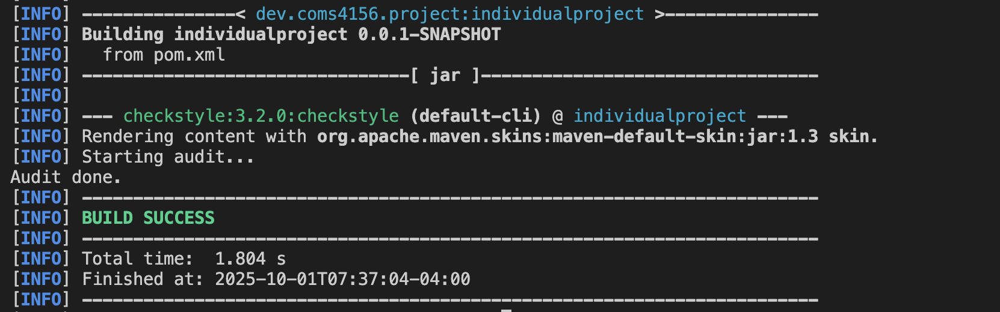
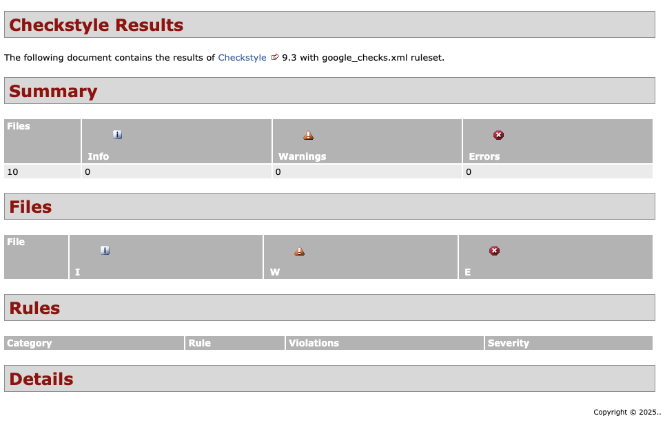
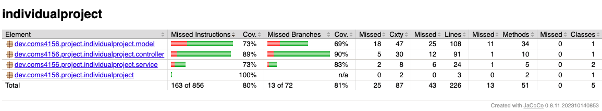

# COMS-4156 Mini Project

## Local Set Up
---
In order to properly set up the codebase on a local machine, you must install the following: 
1. JDK 17: This project used JDK 17 for development:
https://www.oracle.com/java/technologies/javase/jdk17-archive-downloads.html
2. IntelliJ IDE: We recommend using IntelliJ but you are free to use any other IDE:
https://www.jetbrains.com/idea/download/?section=windows
3. When you open IntelliJ you can choose to clone a project from a GitHub repo. Click the green Code button on GitHub, copy the provided HTTPS URL, and paste it into IntelliJ to clone the repo.
4. In order to compile and run the service run these commands from the `IndividualProject` directory. It will start the server where you can make requests at `127.0.0.1:8080` or `localhost:8080`:
```
mvn compile
mvn spring-boot:run
```
5. To run the style checker run `mvn checkstyle:check` or `mvn checkstyle:checkstyle` to generate a report. The HTML report generated is located in `IndividualProject/target/site/checkstyle.html`.  Run these commands from the `IndividualProject` directory.

## Running Tests 
---
Tests are located under the directory `IndividualProject/src/test`. To run the tests, from the `IndividualProject` directory run `mvn clean test`. To generate JaCoCo coverage report in the `target/site/jacoco` directory, run `mvn jacoco:report `.  

## Endpoints
---
- `GET /book/{id}`
  - Returns the details of the specified book.
  - Expected Input Parameters: id (int) representing the unique identifier of the book to retrieve.
  - Expected Output: Matching `Book` object with an HTTP 200 response if successful, or a message indicating that the book was not found with an HTTP 404 response.

- `PUT /books/available`
  - Get and return a list of all the books with available copies.
  - Expected Input Parameters: N/A
  - Expected Output: List of available `Book` objects with an HTTP 200 response if sucessful, or a message indicating an error occurred with an HTTP 500 response.

- `PATCH /book/{bookId}/add`
  - Adds a copy to the `Book` object if it exists.
  - Expected Input Parameters: bookId (int) representing the unique id of the book.
  - Expected Output: Updated `Book` object with an HTTP 200 response if successful, or HTTP 404 if the book is not found, or a message indicating an error occurred with an HTTP 500 code.

- `GET /books/recommendation`
  - Returns 10 unique recommended books (5 most popular by number of checkouts, 5 random books).
  - Expected Input Parameters: N/A
  - Expected Output: List of 10 unique `Book` objects with an HTTP 200 if successful or HTTP status and error message indicating an error occurred.

- `PATCH /checkout?id={bookId}`
  - Check out copy of book.
  - Expected Input Parameters: bookId (int) representing id of the book to check out.
  - Expected Output: Updated {@code Book} with an HTTP 200 if successful, HTTP 404 if book is not found, HTTP 409 if no copy available, or a message indicating an error occurred with an HTTP 500 code.

## Style Checking Report
---
Below shows the checkstyle report generated by running the `mvn checkstyle:checkstyle` command: 



## Branch Coverage Reporting
--- 
Below shows the JaCoCo coverage report: 


## Continuous Integration
---
GitHub Actions workflow at `.github/workflows/ci.yml` automatically runs. The triggers are push and pull_request targeting `main`. The Steps steps are: Java 17 setup, build, `mvn clean test`, and `mvn jacoco:report`. 


